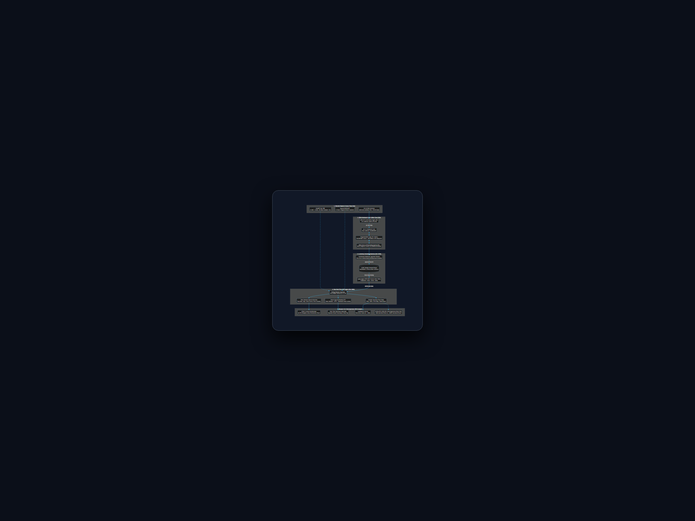
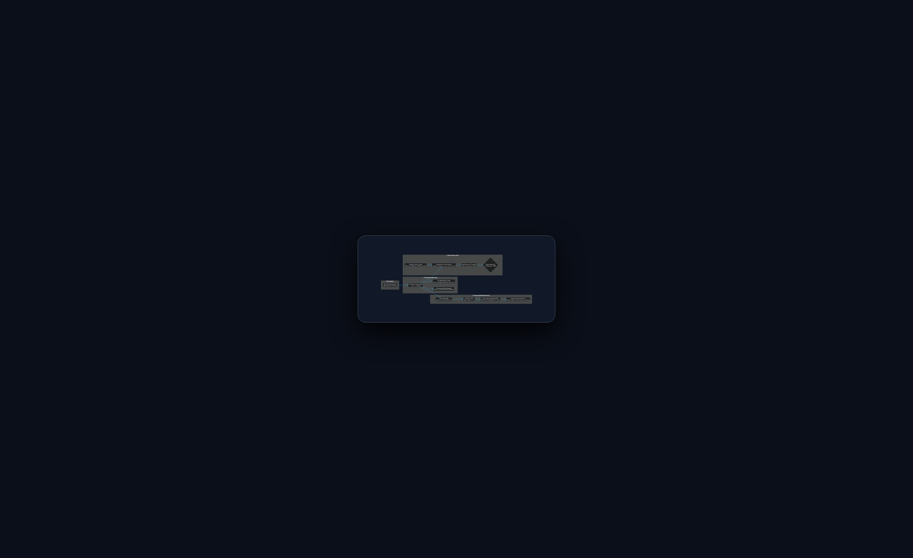
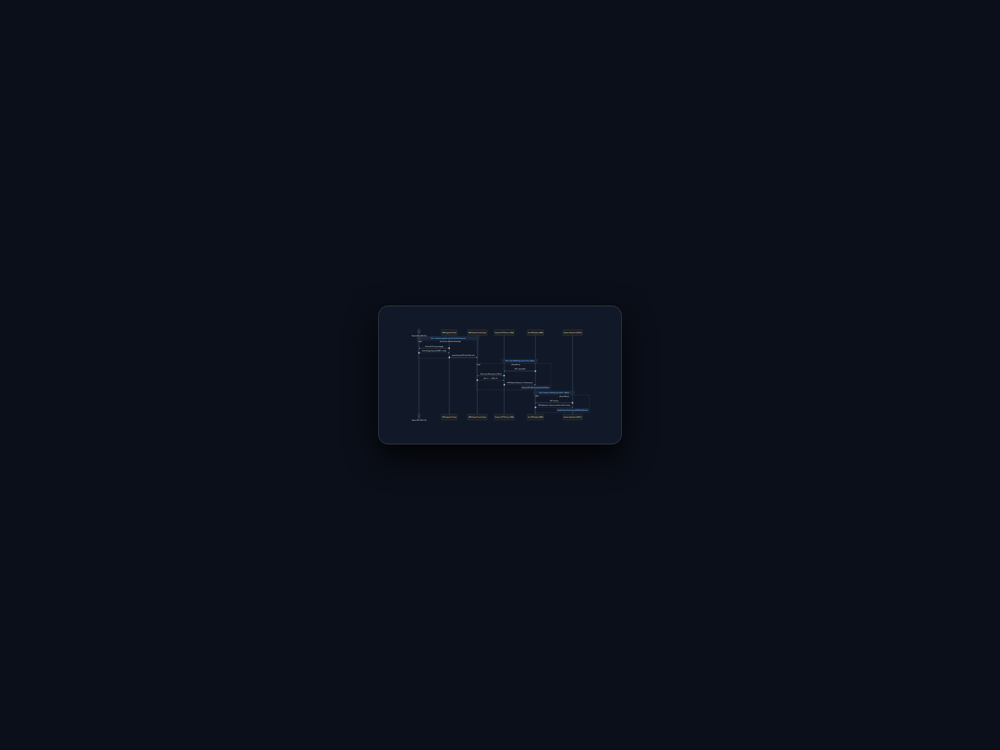

# FPGA ADC Live Signal Analysis & Heterogeneous DSP Pipeline

Comprehensive architectural documentation, mathematical formulation, and multi-tier dataflow models for the FPGA-to-Browser DSP and GPU matched-filter laboratory.

---

## 1. System End-to-End Architecture

This architecture integrates real-time physical signal acquisition on a Xilinx Zynq-7020 SoC, non-blocking in-memory circular buffering, host digital signal processing (FFT, PSD, Spectral Entropy), and real-time visualization alongside a scalable NVIDIA RTX 3090 GPU matched-filter backend.

### Key Architectural Layers:

1. **Physical Front-End & Sensors:**
   - **Precision Baseband:** A 10 cm jumper wire connected to Channel A0 of a 16-bit ADS1115 Delta-Sigma ADC (`0x48`), acting as a capacitive pickup for ambient $50\text{ Hz}$ AC power line hum and electromagnetic noise.
   - **Continuous RF:** HackRF One SDR ($1\text{ MHz} - 6\text{ GHz}$, up to $20\text{ MSps}$ continuous complex I/Q).
   - **High-Speed Transients:** Hantek DSO5102P triggered burst capture ($1\text{ GSa/s}$, $1\text{ Mpts}$ memory).

2. **FPGA Hardware Platform (Xilinx Zynq-7020):**
   - **Programmable Logic (PL):** 220 DSP48E1 slices, MicroBlaze I/O Processor (IOP) subsystem running the base overlay bitstream.
   - **AXI IIC Core (`0x40800000`):** Direct hardware register interface eliminating OS context-switching overhead.
   - **Processing System (PS):** Dual ARM Cortex-A9 running embedded Linux.

3. **In-Memory Streaming Daemon (`pynq_streamer_service.py` on Port 5050):**
   - Keeps the FPGA bitstream persistently loaded in memory.
   - Dedicated hardware thread sampling continuously at $116.4\text{ Sa/s}$.
   - Thread-safe double-ended queue (`collections.deque(maxlen=4096)`).
   - Lightweight HTTP server returning sliced $N$-sample arrays in **$<150\ \mu\text{s}$**.

4. **Host Real-Time DSP Engine (`live_dsp_analyzer.py` on Port 8080):**
   - Slices 256-sample sliding windows every $80\text{ ms}$ ($12.5\text{ updates/sec}$).
   - Computes time-domain statistics, Hann windowing, and Real FFT Power Spectral Density.
   - Runs the parallel Matched-Filter Bank.

5. **Browser Interface & GPU Heterogeneous Back-End:**
   - Zero-dependency HTML5 Canvas rendering an **oscilloscope-like** phosphor trace at 60 FPS.
   - Power Spectral Density waterfall with automatic dominant peak locking.
   - Target GPU Back-End: NVIDIA GeForce RTX 3090 ($10,496\text{ CUDA cores}$, $24\text{ GB GDDR6X}$) executing up to $100,000$ parallel matched filters under a sustained $\sim 200\text{ W}$ power limit.

---

## 2. Digital Signal Processing (DSP) Pipeline

The real-time DSP engine transforms raw, digitized voltage time-series into actionable frequency spectra, stochastic metrics, and pattern correlation scores.

### Mathematical Formulation:

#### A. Time-Domain Characterization
1. **DC Removal / Detrending:**
   $$x_{AC}[n] = x[n] - \mu_x, \quad \mu_x = \frac{1}{N}\sum_{i=0}^{N-1} x[i]$$
   Removes the standing $+0.293\text{ V}$ bias to prevent DC energy from overwhelming the spectrum.

2. **True RMS & Peak-to-Peak ($V_{pp}$):**
   $$V_{RMS} = \sqrt{\frac{1}{N}\sum_{n=0}^{N-1} x^2[n]}, \quad V_{pp} = \max(x) - \min(x)$$

3. **Crest Factor & Zero-Crossing Rate ($ZCR$):**
   $$\text{Crest Factor} = \frac{|V_{peak}|}{V_{RMS(AC)}}, \quad ZCR = \frac{1}{T_{window}} \sum_{n=1}^{N-1} \mathbb{I}(x_{AC}[n] \cdot x_{AC}[n-1] < 0)$$

#### B. Frequency-Domain Processing
1. **Hann Windowing:**
   $$w[n] = 0.5 - 0.5 \cos\left(\frac{2\pi n}{N}\right), \quad x_w[n] = x_{AC}[n] \cdot w[n]$$
   Suppresses boundary discontinuity sidelobes by $>31\text{ dB}$.

2. **Real Fast Fourier Transform ($rFFT$):**
   $$X[k] = \sum_{n=0}^{N-1} x_w[n] \cdot e^{-j 2\pi k n / N}, \quad k = 0, 1, \dots, \frac{N}{2}$$

3. **Single-Sided Power Spectral Density (PSD in dBV):**
   $$P[k] = \frac{2 \cdot |X[k]|^2}{N \cdot \sum_{n=0}^{N-1} w^2[n]}, \quad \text{PSD}_{dB}[k] = 10 \log_{10}(P[k] + \epsilon)$$

4. **Spectral Entropy ($H_{spec}$):**
   $$p_k = \frac{P[k]}{\sum_{j} P[j]}, \quad H_{spec} = -\frac{1}{\log_2(K)} \sum_{k=1}^{K} p_k \log_2(p_k + 1e-15)$$
   Quantifies structured tone concentration ($H_{spec} \to 0$) versus white noise ($H_{spec} \to 1$).

#### C. Matched-Filter Bank (Cross-Correlation)
For an incoming window $x[n]$ and signature template $h_k[m]$ of length $M$:
$$\rho_k(\tau) = \frac{\sum_{m=0}^{M-1} (x[\tau+m] - \bar{x})(h_k[m] - \bar{h}_k)}{\sqrt{\sum_{m=0}^{M-1} (x[\tau+m] - \bar{x})^2} \cdot \sqrt{\sum_{m=0}^{M-1} (h_k[m] - \bar{h}_k)^2}}$$

When $\max(\rho_k) \ge 0.65$, an active `DETECTED` alert is asserted on the dashboard.

---

## 3. Decoupled Multi-Tier Threading & Sequence Model

Directly polling physical hardware synchronously from web requests causes severe I2C bus contention, high latency, and dropped samples. A multi-tier decoupling architecture is implemented.

### Tier Separation:

| Tier | Component | Frequency / Period | Execution Mechanism | Latency |
| :--- | :--- | :--- | :--- | :--- |
| **Tier 1: Hardware Sampling** | `pynq_streamer_service.py` worker thread | $116.4\text{ Hz}$ continuous | Direct register reads via AXI IIC FIFO (`0x40800000`) | Non-blocking, $0\text{ dropped samples}$ |
| **Tier 2: In-Memory Ring Buffer** | Python `collections.deque(maxlen=4096)` | Continuous | RAM buffer holding the last $35\text{ seconds}$ of history | $<150\ \mu\text{s}$ memory slicing |
| **Tier 3: Host DSP Ingestion** | `live_dsp_analyzer.py` poller | $12.5\text{ Hz}$ ($80\text{ ms}$) | HTTP GET `/data?n=256` over LAN | $<2\text{ ms}$ payload transfer |
| **Tier 4: Browser UI Polling** | HTML5 Canvas Frontend | $10\text{ Hz}$ ($100\text{ ms}$) | REST GET `/api/dsp` fetching JSON telemetry | $60\text{ FPS}$ smooth local animation |
